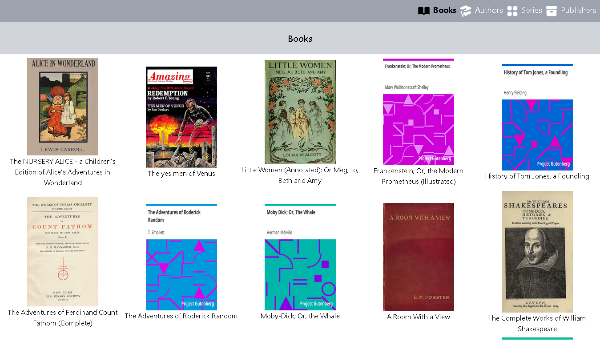
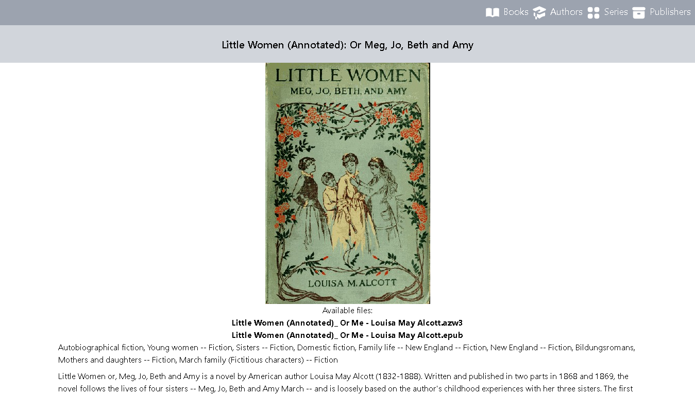
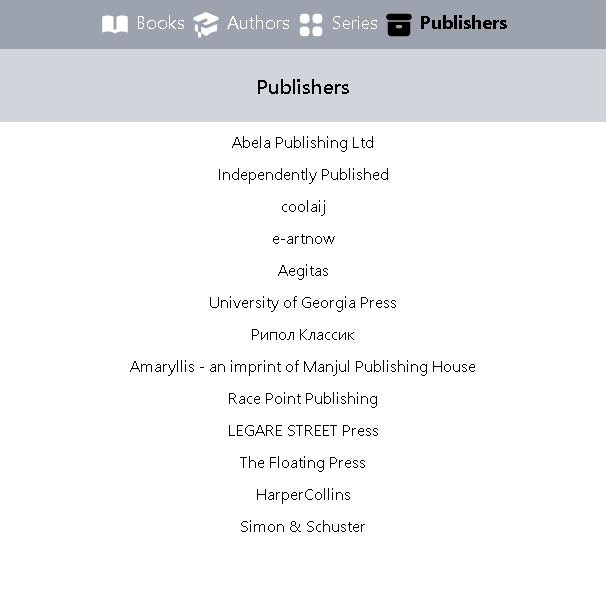
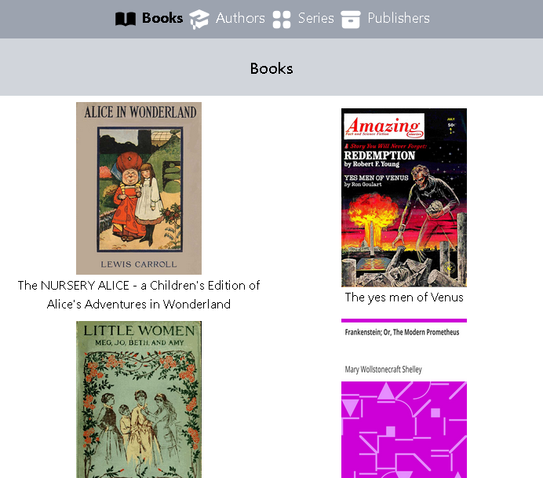

### Laravel calibre library
A Kindle friendly alternative web interface for [Calibre Ebook Management](https://calibre-ebook.com/).

### The problem
As most people who read e-books are well aware, Kindle devices have a rudimentary web browser that cannot handle complex JavaScript. This project hosts a library using server-rendered pages with no client-side scripts. The idea is to deliver a page with barebones HTML and CSS to make it possible to view and download books from the library directly from a Kindle device, with no need to mess with cables or Amazon's e-mail service.

### Instalation
You can quickly try out this project by running the following commands:
```
git clone https://github.com/leandrorsant/laravel-calibre-library
cd laravel-calibre-library
composer install
npm i
npm run dev
php artisan serve
```
Keep in mind that you may want to set up a dedicated [Apache](https://apache.org/) or [Nginx](https://nginx.org/en/) server to run this project in production.

Once all dependencies are installed, you'll need to either move your calibre library to "/storage/app/public/calibre_library", or create a symbolic link to it. Then create a .env file with the following configuration:
```
DB_CONNECTION=sqlite
DB_DATABASE=<full path to your calibre library's "metadata.db">
```
You can make copy of this projects .env.example file, saving it as .env, and edit the variables accordingly.


### Screenshots



